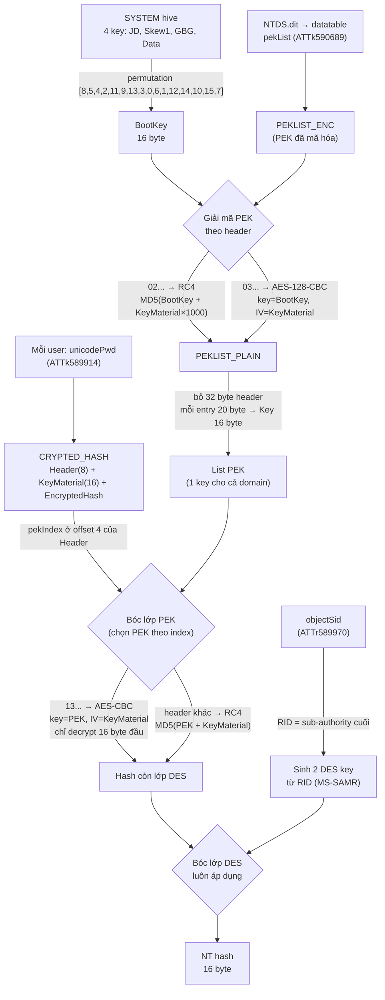
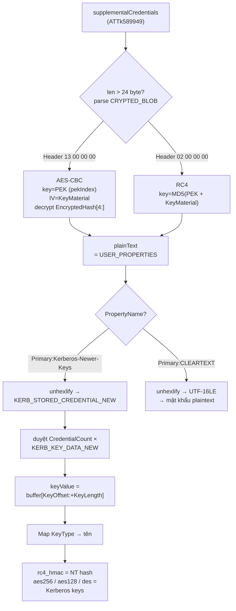
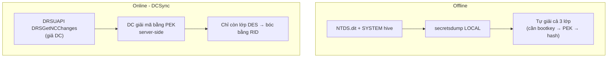
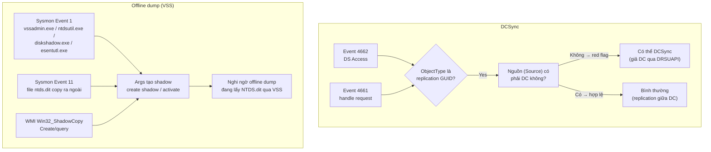

# Module 6 — NTDS.dit: Domain Credential Storage

> **Mục tiêu:** trả lời "credential của **toàn domain** nằm ở đâu, mã hóa mấy lớp, và muốn đọc thì cần những gì" 

---

## 1. NTDS.dit là gì

| Câu hỏi | Trả lời |
|---|---|
| **What** | Database chứa toàn bộ directory data của Active Directory trên một DC: object, attribute, kể cả secret của user/computer |
| **Where** | `%SystemRoot%\NTDS\ntds.dit` (đường dẫn khai báo ở registry `SYSTEM\CurrentControlSet\Services\NTDS\Parameters` → value `DSA Database file`) |
| **Format** | **ESE** (Extensible Storage Engine / "Jet Blue", engine của `esent.dll`) —  Magic signature `0x89ABCDEF` ở đầu header page, page size 8192 byte |
| **Who** | Chỉ process NTDS (lsass.exe) giữ file **lock vĩnh viễn** khi DC chạy → không copy trực tiếp được, phải qua Volume Shadow Copy |

Các bảng chính trong database:

| Bảng | Chứa gì |
|---|---|
| `datatable` | object AD (user, computer, group...) — **mọi thứ chúng ta cần đều ở đây** |
| `link_table` | linked attributes (như `member`) |
| `sd_table` | security descriptors |
| `hiddentable` | secrets nội bộ (như DNT index) |

Mỗi attribute được lưu như một **tagged column** trong bảng — đây là lý do parser offline (impacket `ese.py`, `esedbexport` của libesedb) phải đọc metadata column, không thể đoán offset cố định.


### Bảng attribute cần nhớ

Nguồn: `NTDSHashes.NAME_TO_INTERNAL` trong impacket secretsdump.py (đã đối chiếu source).

| Attribute | Tên cột trong ESE | OID (LDAP) | Chứa gì |
|---|---|---|---|
| `unicodePwd` | `ATTk589914` | 1.2.840.113556.1.4.90 | **NT hash** (đã mã hóa) |
| `dBCSPwd` | `ATTk589879` | 1.2.840.113556.1.4.55 | **LM hash** (đã mã hóa, nếu NoLMHash chưa bật) |
| `supplementalCredentials` | `ATTk589949` | 1.2.840.113556.1.4.125 | **Kerberos AES/DES keys**, có thể cả CLEARTEXT |
| `pekList` | `ATTk590689` | (attribute trên domain object) | **PEK đã mã hóa** |
| `ntPwdHistory` / `lmPwdHistory` | `ATTk589918` / `ATTk589984` | ...1.4.94 / ...1.4.160 | Lịch sử hash (bóc cùng 2 lớp) |
| `objectSid` | `ATTr589970` | 1.2.840.113556.1.4.146 | SID — **cần để lấy RID cho lớp DES** |
| `userAccountControl` | `ATTj589832` | 1.2.840.113556.1.4.8 | Flags trạng thái account |
| `pwdLastSet` | `ATTq589920` | 1.2.840.113556.1.4.96 | Timestamp — giá trị DFIR quan trọng |


```text
Domain Controller (DC)
   │
   ├── SYSTEM hive  (ngoài database) ── bootkey ──┐
   │                                              │
   └── NTDS.dit  (ESE database)                   ▼
        └─ datatable                      [Giải mã PEK]
             ├── pekList  ← chứa PEK đã mã hóa  (1 key cho cả domain)
             └── mỗi object user:
                  ├── unicodePwd       → NT hash   (bọc 2 lớp nữa)
                  ├── dBCSPwd          → LM hash
                  └── supplementalCredentials → Kerberos keys / CLEARTEXT
```

## 2. PEK — chìa khóa của cả domain

**một key đối xứng chung cho toàn domain** gọi là PEK (Password Encryption Key, 16 byte).

**Điểm đáng chú ý:** bản thân PEK cũng được lưu **ngay trong NTDS.dit**, ở attribute `pekList` của domain object (cột `ATTk590689`) — nhưng đã mã hóa bằng **bootkey** từ SYSTEM hive. 

Vì `pekList` được replicate giữa các DC, **PEK giống nhau trên mọi DC** → chỉ cần lấy được 1 DC là đủ mở secret của cả domain (đây là lý do outline nhấn "1 DC là đủ").

## 3. Giải mã NT hash từ NTDS.dit 

### a. Lấy Boot Key (từ SYSTEM hive)

Đọc class name của 4 key JD, Skew1, GBG, Data dưới CurrentControlSet\Control\Lsa, ghép lại rồi permutation theo bảng [8,5,4,2,11,9,13,3,0,6,1,12,14,10,15,7] → boot key 16 byte.

### b. Lấy PEK List (từ attribute pekList trong NTDS.dit)
Đọc datatable, tìm record có cột ATTk590689 (pekList) — chỉ nằm ở 1 record duy nhất (domain root).
Giải mã PEKLIST_ENC bằng boot key:
Header 02... → RC4, key = MD5(bootKey + KeyMaterial×1000)
Header 03... → AES-128-CBC, key = bootKey trực tiếp, IV = KeyMaterial
Kết quả PEKLIST_PLAIN (bỏ 32 byte header đầu) chứa mảng nhiều PEK_KEY 20 byte (Header(1)+Padding(3)+Key(16)) → list các PEK 16-byte.


### c. Lấy RID từ objectSid (ATTr589970) — điểm mấu chốt dễ sai

SID chuẩn: Revision(1) + SubAuthorityCount(1) + IdentifierAuthority(6) + SubAuthority(4×N), RID = sub-authority cuối.

### d. Giải mã NT hash cho từng user (attribute unicodePwd = ATTk589914)

Mỗi hash là blob CRYPTED_HASH/CRYPTED_HASHW16 gồm Header(8) + KeyMaterial(16) + EncryptedHash:

Chọn đúng PEK: pekIndex nằm ở byte offset 4 của Header.
Bóc lớp PEK:
Header 13... → AES-CBC (key=PEK, IV=KeyMaterial), chỉ decrypt 16 byte đầu EncryptedHash
Header khác → RC4, key = MD5(PEK + KeyMaterial)
Bóc lớp DES (luôn áp dụng mọi version): sinh 2 DES key từ RID theo [MS-SAMR] 2.2.11.1.3, decrypt ECB 2 nửa 8-byte → ra NT hash 16 byte cuối cùng.



## 4. supplementalCredentials — Kerberos

Ngoài NTLM hash, NTDS.dit còn chứa **Kerberos keys** trong `supplementalCredentials` (cột `ATTk589949`). Blob này cũng được bọc bằng lớp PEK như trên (header `02` → RC4, header `13` → AES).

### a. Bóc lớp PEK

`__decryptSupplementalInfo()` đọc attribute, nếu blob dài hơn 24 byte thì parse thành `CRYPTED_BLOB` = Header(8) + KeyMaterial(16) + EncryptedHash:

- Header `13 00 00 00` → **AES-CBC**: key = PEK (chọn theo `pekIndex` ở byte offset 4 của Header), IV = KeyMaterial, decrypt phần `EncryptedHash[4:]`.
- Header khác (`02 00 00 00`) → **RC4**: key = `MD5(PEK + KeyMaterial)`, RC4 decrypt `EncryptedHash`.

Kết quả `plainText` chính là chuỗi `USER_PROPERTIES` theo [MS-SAMR].

### b. Parse USER_PROPERTIES

`samr.unpack_user_properties()` trả về danh sách `USER_PROPERTY`, mỗi property có:

| Field | Nội dung |
|---|---|
| `PropertyName` | chuỗi UTF-16LE, ví dụ `Primary:Kerberos-Newer-Keys` / `Primary:CLEARTEXT` |
| `PropertyValue` | chuỗi hex (payload của property) |

### c. Parse `Primary:Kerberos-Newer-Keys`

Unhexlify `PropertyValue` → `KERB_STORED_CREDENTIAL_NEW`:

| Field | Kích thước | Ý nghĩa |
|---|---|---|
| `Revision` | 2 byte | luôn = 4 |
| `Flags` | 2 byte | bỏ qua khi đọc |
| `CredentialCount` | 2 byte | số key hiện tại |
| `ServiceCredentialCount` | 2 byte | số service key (SPN-salted) |
| `OldCredentialCount` / `OlderCredentialCount` | 2 byte | key của mật khẩu cũ |
| `DefaultSalt*` / `DefaultIterationCount` | ... | thông tin salt (SHOULD ignore on read) |
| `Credentials[]` | variable | mảng `KERB_KEY_DATA_NEW` |
| `KeyValues[]` | variable | chứa key bytes thật |

Mỗi phần tử `KERB_KEY_DATA_NEW`:

| Field | Ý nghĩa |
|---|---|
| `KeyType` | loại key (map qua `NTDSHashes.KERBEROS_TYPE`) |
| `KeyLength` | độ dài key |
| `KeyOffset` | offset từ đầu attribute value → vị trí key trong `KeyValues` |

`keyValue = propertyValueBuffer[KeyOffset : KeyOffset + KeyLength]`.

### d. Parse `Primary:CLEARTEXT`

`PropertyValue` rồi decode UTF-16LE → mật khẩu plaintext (chỉ tồn tại khi bật reversible encryption).

Đây là mối nối quan trọng: **RC4 Kerberos key = NT hash** → Golden Ticket dùng được ngay NTLM hash krbtgt; còn AES key thì phải lấy từ `Kerberos-Newer-Keys` (Module 5 đã giải thích salt string2key khác nhau).



---

## 5. Hai con đường lấy hash — Offline vs DCSync

### a. Offline (chạm tay vào file)

DC giữ `ntds.dit` lock vĩnh viễn → phải copy qua **Volume Shadow Copy** (VSS):

```text
vssadmin create shadow /for=C:                    → tạo shadow
copy \\?\GLOBALROOT\Device\...\ntds.dit  ntds.dit  → copy bản snapshot
vssadmin delete shadows ...                        → dọn dẹp
```

Sau đó dump offline (cần cả SYSTEM hive để lấy bootkey):

```text
secretsdump.py -system SYSTEM -ntds ntds.dit LOCAL
```

Dòng xử lý đúng như chuỗi ở mục 5: `getBootKey()` từ SYSTEM → `__getPek()` từ pekList → `__removeRC4Layer` → `__removeDESLayer`.

### b. Online — DCSync (không đụng file)

**Bản chất:** giả làm DC, gọi giao thức replication **DRSUAPI `DRSGetNCChanges`** (đặc tả [MS-DRDS]) để yêu cầu DC "gửi bản sao" các attribute secret.

```text
secretsdump.py -just-dc -hashes <LM:NT> DOMAIN/user@DC-IP
mimikatz # lsadump::dcsync /domain:DOMAIN /user:krbtgt
```

Điểm khác biệt cơ chế cốt lõi: **chính DC tự giải mã** phần PEK cho bạn. Theo [MS-DRDS] `DecryptAttributeValue`, server bóc lớp mã hóa bằng PEK rồi mới gửi qua dây; kẻ tấn công chỉ còn phải gỡ **lớp DES bằng RID** (impacket làm ở `drsuapi.removeDESLayer`). Vì vậy DCSync **không cần bootkey, không cần SYSTEM, không cần VSS** — chỉ cần quyền replication:

- `DS-Replication-Get-Changes` (đọc user thường)
- `DS-Replication-Get-Changes-All` (đọc cả secret — thường chỉ Domain/Enterprise Admins)



## 6. IOC — Nhận biết Offline dump (vssadmin) vs DCSync

| Kỹ thuật | Artifact cần soi | Dấu hiệu bất thường |
|---|---|---|
| **DCSync** | **Event 4662** (Directory Service Access) | `ObjectType` là GUID replication `1131f6aa...` (Get-Changes) hoặc `1131f6ad...` (Get-Changes-All); nguồn **không phải DC** = red flag |
| **DCSync** | **Event 4661** | Handle request tới object directory — thường xuất hiện cùng 4662 |
| **DCSync** | Correlate logon | Không có chuỗi 4624/4768/4769 tương ứng trước khi có 4662 → nghi là dump hash qua mạng |
| **Offline dump** | **Sysmon Event 1** (Process Create) | Tiến trình `vssadmin.exe`, `ntdsutil.exe`, `diskshadow.exe`, `esentutl.exe` — đặc biệt với args `create shadow`, `copy ...\ntds.dit`, `activate` |
| **Offline dump** | **Sysmon Event 11** (File Create) | Tạo file `ntds.dit` copy ra thư mục lạ (Temp, USB, SMB share) |
| **Offline dump** | **WMI / Win32_ShadowCopy** | Truy vấn/tạo snapshot qua `Win32_ShadowCopy.Create` — DC gần như không bao giờ tạo VSS thủ công |
| **Offline dump** | VSS artifact | Shadow copy xuất hiện bất thường trên DC, hoặc `\\?\GLOBALROOT\Device\HarddiskVolumeShadowCopyN\...\ntds.dit` được truy cập |




